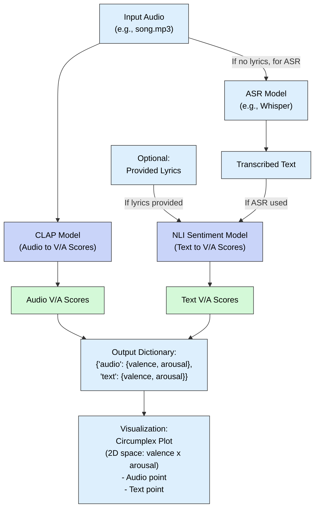

# song_sent_scores: Functions for multimodal song circumplex analysis in R and Python


[](https://www.gnu.org/licenses/gpl-3.0) <!-- Adjust license badge if needed -->

This repository provides tools for multimodal song sentiment analysis based on Russell's Circumplex Model of Affect (Valence/Arousal). It includes implementations in both R and Python.

*   **R Implementation:** Utilizes custom functions `song_sent_scores()` and `plot_circumplex_scores()` to analyze sentiment derived from both the audio signal (using a CLAP model) and the song lyrics (using a Natural Language Inference / Zero-Shot model via `reticulate`). The analysis includes an option for automatic speech recognition (ASR) to transcribe lyrics using OpenAI's Whisper model.
*   **Python Implementation:** A standalone Python script (`song_sent_scores_py_cached.py`) and potentially an accompanying Google Colab notebook (`.ipynb`) offer similar core analysis functionality using libraries like Transformers, Librosa, and optionally `yt-dlp`.

The tools estimate Valence (Negative/Positive) and Arousal (Low/High) scores for both audio and text modalities, allowing for a dynamic analysis of sentiment throughout a song.

The core components are as follows:

1.  **Input Audio:** The toolkit takes a song audio file (e.g., MP3, WAV) as input. This audio is used for both direct sonic analysis and, if lyrics are not provided, for ASR.

2.  **Audio Affective Analysis (CLAP):** The raw audio signal is processed by a Contrastive Language-Audio Pretraining (CLAP) model. This model generates embeddings of the audio segments and performs zero-shot classification against predefined textual descriptions of affective states (e.g., 'audio with positive valence', 'audio with high arousal') to infer Valence and Arousal scores directly from the sonic characteristics. This results in the *Audio V/A Scores*.

3.  **Lyrical Content Processing:**
    *   **Optional Provided Lyrics:** Users can directly supply the song lyrics.
    *   **Automatic Speech Recognition (ASR):** If lyrics are not provided, the input audio is fed into an ASR model (e.g., OpenAI's Whisper) to generate *Transcribed Text*.

4.  **Text Affective Analysis (NLI):** The obtained lyrical content (either provided or transcribed) is then analyzed by a Natural Language Inference (NLI) based zero-shot text classification model. This model assesses the interaction between lyrics and phrases representing different Valence and Arousal states to produce the *Text V/A Scores*.

5.  **Output Aggregation:** The derived *Audio V/A Scores* and *Text V/A Scores* are compiled into an output dictionary, typically structured with separate entries for 'audio' and 'text' modalities, each containing their respective valence and arousal values.

6.  **Visualization:** Finally, these scores are mapped as coordinates onto a 2D circumplex plot. This plot visually represents the song segment's position in the Valence-Arousal space, with distinct points for the audio and text modalities, allowing for an intuitive understanding of the song's multimodal affective profile.

This pipeline allows `song_sent_scores` to offer a comprehensive, multimodal assessment of a song's perceived emotional character, moving beyond unimodal analysis or simplistic discrete emotion labels.


---

## R Implementation

### Features

*   **`song_sent_scores()` function:**
    *   Performs sentiment classification (Valence and Arousal pairs) on audio segments using a CLAP model (e.g., `laion/clap-htsat-unfused`).
    *   Optionally performs sentiment classification (Valence and Arousal pairs) on song lyrics using an NLI/Zero-Shot model (e.g., `joeddav/xlm-roberta-large-xnli`) via `reticulate`.
    *   Optionally transcribes audio segments to text using an ASR model (e.g., `openai/whisper-base`, `openai/whisper-large-v3`).
    *   Allows analysis of specific time segments (`start_sec`, `end_sec`).
    *   Accepts pre-written lyrics as input, skipping transcription.
    *   Includes an option for caching Python models within the R session for faster repeated analyses.
*   **`plot_circumplex_scores()` function:**
    *   Visualizes the Valence and Arousal scores obtained from `song_sent_scores()` on a 2D circumplex plot.
    *   Generates a scatter plot comparing audio-based and text-based sentiment coordinates using `ggplot2`.
*   **Looping Example (`TEMPLATE.Rmd`):**
    *   Demonstrates how to loop through a song in chunks (e.g., 15 seconds).
    *   Calls `song_sent_scores()` for each chunk.
    *   Calculates the final Valence (`a_v`, `t_v`) and Arousal (`a_a`, `t_a`) coordinates for each chunk.
    *   Stores results in a data frame suitable for dynamic analysis (e.g., with `EGAnet::dynEGA` or time series plotting).

### Prerequisites

To run the analysis presented in the R files (`song_sent_scores.r`, `plot_circumplex_scores.r`, `TEMPLATE.Rmd`), you need the following set up:

1.  **R:** A recent version of R. RStudio is recommended.
2.  **R Packages:** Install required packages from CRAN:
    ```R
    install.packages(c("reticulate", "dplyr", "purrr", "tidyr", "ggplot2", "tictoc"))
    ```
    *   `reticulate`: Handles the R-Python interface.
    *   `dplyr`, `purrr`, `tidyr`: Used for data manipulation (especially in the looping example).
    *   `ggplot2`: Used for plotting (`plot_circumplex_scores` and example plots).
    *   `tictoc`: Used for timing function execution.
3.  **Python Environment (via Miniconda/Anaconda):** The analysis relies heavily on Python libraries. `reticulate` needs to connect to a Python environment where these are installed.
    *   **Environment Setup:** Ensure you have a Conda environment (Miniconda or Anaconda) accessible by R. You can configure `reticulate` to find it (see `?use_condaenv`).
    *   **Python Packages:** Install the necessary Python packages within your chosen Conda environment. Open your system Terminal or Anaconda Prompt, activate the environment, and install them:
        ```bash
        # Example: Activate your environment (replace 'your_env_name')
        conda activate your_env_name

        # Install essential libraries for ML, audio, and performance
        pip install torch transformers accelerate librosa soundfile pandas numpy resampy sentencepiece

        # Deactivate when done (optional)
        # conda deactivate
        ```
        *   `torch`, `transformers`, `sentencepiece`: Core Hugging Face libraries.
        *   `accelerate`: Often recommended for efficient execution of Hugging Face pipelines.
        *   `librosa`, `soundfile`, `resampy`: For robust audio loading, processing, and resampling.
        *   `pandas`, `numpy`: For data handling within Python helpers.
    *   **FFmpeg (Highly Recommended):** For `librosa` to load a wide variety of audio formats (especially `.mp3`), FFmpeg is often required. Install it within the Conda environment:
        ```bash
        # Activate the environment (if not already active)
        conda activate your_env_name

        # Install ffmpeg from the conda-forge channel (recommended)
        conda install -c conda-forge ffmpeg -y
        ```
    *   **GPU Support (Recommended):** Ensure your PyTorch installation matches your CUDA version if you intend to use a GPU. Follow instructions on the [PyTorch website](https://pytorch.org/).

### Usage

1.  **Set up** the R and Python prerequisites as described above.
2.  **Open R/RStudio.**
3.  **Configure Reticulate:** Tell `reticulate` which Python/Conda environment to use *before* loading Python libraries or running Python code. Replace `"your_env_name"` with the actual name of your Conda environment.
    ```R
    library(reticulate)
    use_condaenv("your_env_name", required = TRUE)
    # Verify Python connection (optional)
    # py_config()
    ```
4.  **Define/Source R Functions:** Load the R code for `song_sent_scores()` and `plot_circumplex_scores()` into your R session (e.g., using `source("song_sent_scores.r")` and `source("plot_circumplex_scores.r")`).
5.  **Run Python Setup (for Cached Version):** Execute the `python_cache_setup_code` string (which should be defined within `song_sent_scores.r` or sourced separately) using `reticulate::py_run_string()` **once per R session**. This defines the Python helper functions and caching mechanism.
6.  **Run Analysis:**
    *   Call `song_sent_scores()` to analyze a specific segment or the whole song.
    *   Call `plot_circumplex_scores()` to visualize the results for a single analysis call.
    *   Use the code provided in `TEMPLATE.Rmd` (or adapt the R loop example from previous discussions) to analyze the entire song in chunks and generate the dynamic data frame (`circumplex_dynamics_df`).

### Example (Single Segment Analysis)

```R
# Load packages
library(reticulate)
library(tictoc)
library(dplyr) # Needed if you use the output later
library(ggplot2) # Needed for plotting

# Configure reticulate (replace with your env name)
use_condaenv("your_env_name", required = TRUE)

# Source the Python setup code AND the R function definitions
# (Assuming they are structured correctly)
source("song_sent_scores.r")
source("plot_circumplex_scores.r")

# Define path to your audio file
my_song_path <- "/content/IdontKnow.mp3" # ADJUST PATH

if (file.exists(my_song_path)) {
  message("Analyzing single segment...")
  results_segment <- song_sent_scores(
    audio_path = my_song_path,
    transcribe_audio = TRUE,
    start_sec = 40, # Example segment
    end_sec = 55,
    asr_language = "en", # Adjust if needed
    asr_model_id = "openai/whisper-base", # Use base for quicker test
    verbose = TRUE,
    verbose_py = FALSE # Keep Python logs quieter after initial load
  )

  print("--- Segment Analysis Results ---")
  print(str(results_segment))

  message("Plotting segment results...")
  segment_plot <- plot_circumplex_scores(results_segment, title = "Sentiment: IdontKnow.mp3 (40s-55s)")
  if (!is.null(segment_plot)) {
    print(segment_plot)
  }

} else {
  warning("Audio file not found, skipping example.")
}
```
### Notes

*   **Model Downloads**: The first time Python code uses a specific Hugging Face model (CLAP, Whisper, NLI), the files are downloaded to ~/.cache/huggingface/hub.
*   **Caching**: The R function song_sent_scores (when used with the provided Python backend code) caches the loaded Python models within the current R session after the first call, making subsequent analyses much faster. Use clear_sentiment_model_caches() (if defined) or restart R to clear the cache.
*   **Resources**: ASR, especially with large models, is resource-intensive. Analysis takes time. GPU is highly recommended.

### Python Implementation

This repository also includes a full implementation in Python.

*   **song_sent_scores_py_cached.py**: A standalone Python script containing the core analysis function (song_sent_scores_py()) with model caching, plotting (plot_circumplex_scores_py()), helper functions, and an example execution block demonstrating chunk analysis.
*   **song_sent_scores_py.ipynb**: An accompanying Google Colaboratory notebook, possibly including interactive elements, which may derive from or align with the .py script.

### Python Prerequisites

Python 3.8+ and the following packages (use a virtual environment):
```bash
# Example Conda environment creation
# conda create -n song_py python=3.9 -y
# conda activate song_py

# Install packages
pip install torch transformers accelerate librosa soundfile pandas numpy resampy sentencepiece
pip install matplotlib

# Optional: For downloading audio
# pip install yt-dlp

# Optional: For better plot labels

# pip install adjustText
```
Ensure torch is installed correctly for your CPU/GPU. FFmpeg should also be installed (e.g., via Conda: conda install -c conda-forge ffmpeg).

### Python Usage
```Python
# Example of importing and using the script's functions
import song_sent_scores_py_cached as ss # Assuming the script is saved as this
import matplotlib.pyplot as plt
import os
import pandas as pd

audio_file = "/content/IdontKnow.mp3" # Replace with your audio file path

if os.path.exists(audio_file):
    # --- Analyze a single segment ---
    print("--- Analyzing Single Segment (Python) ---")
    results_segment = ss.song_sent_scores_py(
        audio_path=audio_file,
        transcribe_audio=True,
        start_sec=15.0,
        end_sec=30.0,
        asr_model_id="openai/whisper-base",
        asr_language="en", # Adjust language
        verbose=True
    )

    print("\n--- Python Segment Analysis Results ---")
    print("Audio Scores:")
    print(pd.Series(results_segment.get('audio_scores')).to_string(float_format="%.4f"))
    print("\nText Scores:")
    print(pd.Series(results_segment.get('text_scores')).to_string(float_format="%.4f"))

    # --- Plot the segment results ---
    fig_segment = ss.plot_circumplex_scores_py(results_segment, title="Python Analysis (15-30s)")
    if fig_segment:
        plt.show()

    # --- Analyze the full song in chunks ---
    print("\n--- Analyzing Full Song in Chunks (Python) ---")
    full_song_df = ss.analyze_full_song_circumplex(
        audio_path=audio_file,
        chunk_duration_s=15.0,
        asr_model_id="openai/whisper-base", # Use smaller model for speed if needed
        asr_language="en", # Adjust language
        verbose_song=True,
        verbose_chunks=False
        )
    if full_song_df is not None:
        print("\n--- Full Song Chunk Analysis DataFrame (Head) ---")
        print(full_song_df.head().to_string())

        # Example plot from full analysis
        plt.figure(figsize=(12, 4))
        plt.plot(full_song_df['start_sec'], full_song_df['a_v'], marker='o', linestyle='-', label='Audio Valence (a_v)')
        plt.plot(full_song_df['start_sec'], full_song_df['t_v'], marker='^', linestyle='--', label='Text Valence (t_v)')
        plt.xlabel("Time (s)")
        plt.ylabel("Valence Score")
        plt.title(f"Valence Over Time - {os.path.basename(audio_file)}")
        plt.legend()
        plt.grid(True, alpha=0.5)
        plt.tight_layout()
        plt.show()

else:
    print(f"Error: Audio file not found at {audio_file}")
```

Using the Notebook (.ipynb):
Open in Google Colab or a local Jupyter environment with prerequisites installed. Run cells sequentially.

### How to Cite

Pedrosa, F. G. (2025). song_sent_scores: Functions for multimodal song circumplex analysis in R and Python. [Software]. https://doi.org/10.5281/zenodo.18481612. Retrieved from https://github.com/FredPedrosa/song_sent_scores

## Author

*   **Prof. Dr. Frederico G. Pedrosa**
*   fredericopedrosa@ufmg.br

### Reference
Russell, J. A. (1980). A circumplex model of affect. Journal of Personality and Social Psychology, 39(6), 1161–1178. https://doi.org/10.1037/h0077714

Tomasevic A, Golino H, Christensen A (2024). “Decoding emotion dynamics in videos using dynamic Exploratory Graph Analysis and zero-shot image classification: A simulation and tutorial using the transforEmotion R package.” _PsyArXiv_. doi:10.31234/osf.io/hf3g7 <https://doi.org/10.31234/osf.io/hf3g7>, <https://osf.io/preprints/psyarxiv/hf3g7>.

## License

This project is licensed under a modified version of the GNU General Public License v3.0. 
Commercial use is not permitted without explicit written permission from the author.


